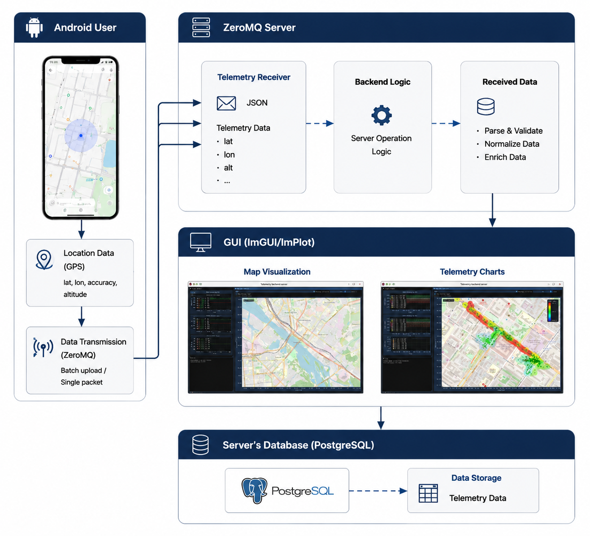

# Telemetry service

Сервер для приема и визуализации данных с ZeroMQ и графическим интерфейсом на ImGui.

## Архитектура

- **Android-клиент** (Kotlin) - сбор GPS, данных сотовых вышек и уровня сигнала, отправка на сервер через ZeroMQ
[https://github.com/KBACokk/Android_back]

- **Серверный бэкенд** (C++) - приём телеметрии, сохранение в файл, визуализация через ImGui/ImPlot
[https://github.com/KBACokk/Android_programm]

## Общая архитектура проекта взаимодействия Android user и Back server.

## Описание

В данном сервисе реаоизован сбор данных, путём получения пакетов с рабочего устройства, содержащих данные о качестве связи, метостоположении и типе связи. 

## Зависимости

- **ZeroMQ** - библиотека для установки соединения с устройства 
- **SDL2** - кросплатформенная мультимедийная библиотека, предназначенная для упрощения разработки интерактивныйх приложений.
- **OpenGL/GLEW** - рендеринг графики
- **Dear ImGui** - интерфейс Immediate Mode GUI
- **STL** - потоки, mutex'ы, файловый ввод/вывод
