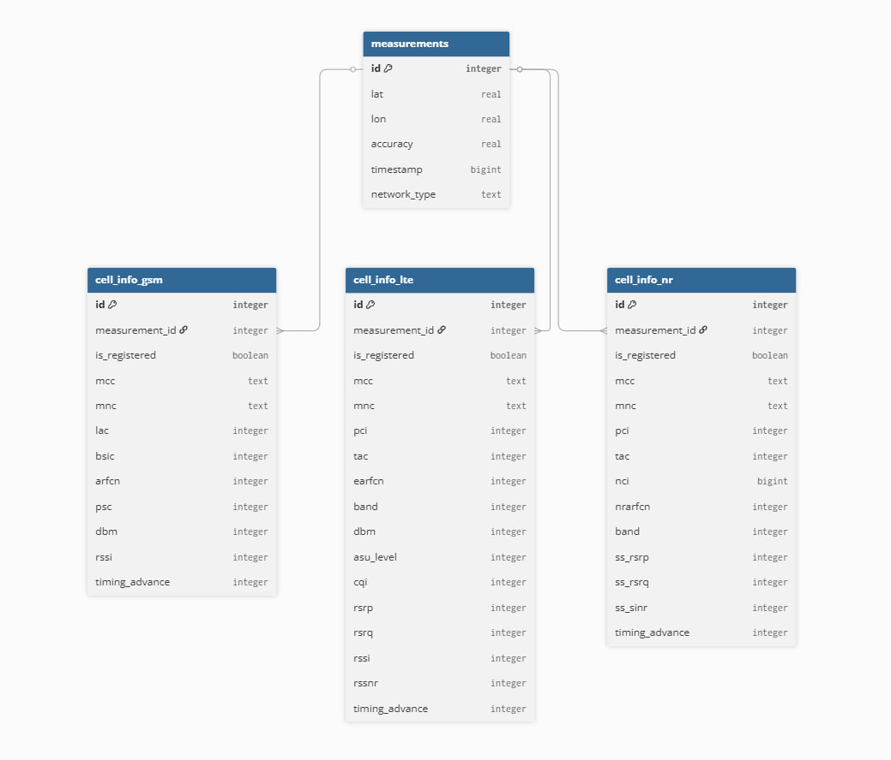

# db/ — Модуль базы данных (PostgreSQL)

Модуль отвечает за подключение к базе данных PostgreSQL, сохранение входящей телеметрии и загрузку исторических данных.

## Архитектура данной части программы:



## Файлы

| Файл | Описание |
|---|---|
| [`db.hpp`](db.hpp) | Заголовочный файл - объявления функций, параметры подключения, структура `HeatmapDbFingerprint` |
| [`db.cpp`](db.cpp) | Реализация всех функций работы с БД |

## Параметры подключения

Параметры подключения к PostgreSQL заданы макросами в [`db.hpp`](db.hpp):

```cpp
#define DB_HOST     "localhost"
#define DB_PORT     "5432"
#define DB_NAME     "telemetry"
#define DB_USER     "postgres"
#define DB_USER_PASSWORD "kba_login"
```

## Основные функции

### Подключение

- **`db_connect()`** - создаёт и возвращает новое соединение `PGconn*` с PostgreSQL.
- **`db_connection_info()`** - возвращает строку подключения в формате libpq.

### Сохранение данных

- **`saveToDatabase(const json& j)`** - сохраняет один JSON-пакет телеметрии в БД:
  1. Открывает транзакцию (`BEGIN`).
  2. Вставляет запись в таблицу `measurements` (координаты, accuracy, timestamp, тип сети).
  3. Для каждой ячейки из массива `cells` вставляет запись в соответствующую таблицу:
     - **LTE** -> `cell_info_lte` 
     - **GSM** -> `cell_info_gsm`
     - **NR** -> `cell_info_nr` 
  4. Фиксирует транзакцию (`COMMIT`) или откатывает при ошибке (`ROLLBACK`).
  5. При успешном сохранении добавляет координаты в `current_telemetry.map_points_*` для отображения на карте.

### Загрузка данных

- **`loadHistoryFromDatabase()`** - загружает до 40 000 последних измерений из БД и заполняет:
  - Массивы координат для карты (`map_points_lon`, `map_points_merc_y`).
  - Историю сигнала (`history`) для графиков.
  - Используется JOIN по трём таблицам cell_info.

## Вспомогательная структура `PqParamBuf`

Внутренний буфер для формирования параметризованных SQL-запросов (`PQexecParams`). Поддерживает типы: `null`, `str`, `bool`, `int`, `bigint`, `text` (из JSON), с автоматической заменой sentinel-значений (`2147483647`) на `NULL`.
