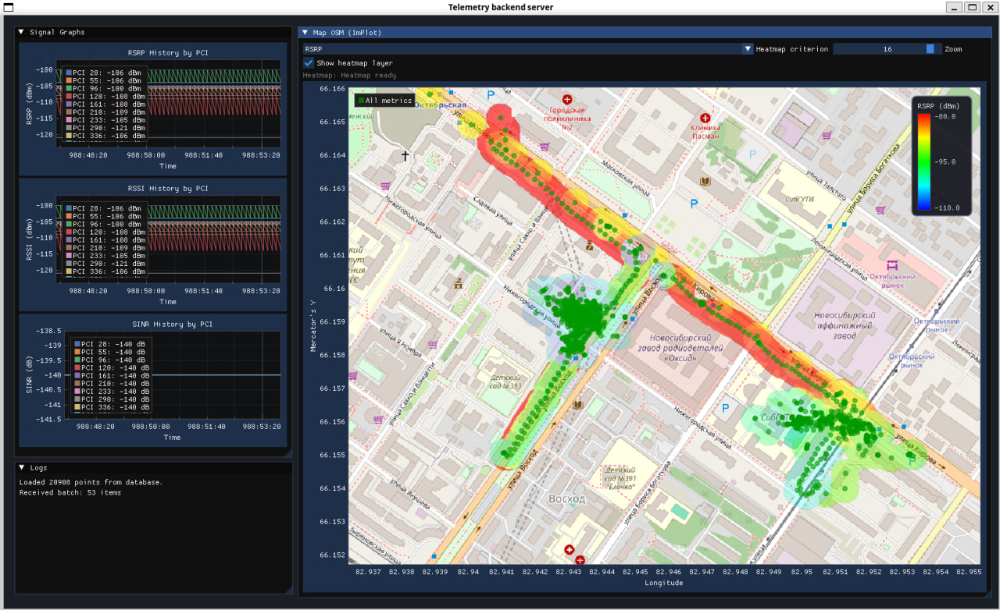

# gui/ - Графический интерфейс (ImGui + ImPlot)

Модуль отвечает за создание окна приложения, рендеринг пользовательского интерфейса и визуализацию данных телеметрии в реальном времени.

## Итоговым вариантом отображения Telemetry_OSM_heatmap является следующая картинка:

## Файлы

| Файл | Описание |
|---|---|
| [`gui.hpp`](gui.hpp) | Заголовочный файл - объявление `run_gui()` |
| [`gui.cpp`](gui.cpp) | Реализация главного цикла рендеринга и всех окон интерфейса |

## Функция `run_gui()`

Главная функция модуля. Выполняет:

### 1. Инициализация

- Инициализация SDL2 (видео + таймер).
- Создание окна `"Telemetry backend server"` размером 1640×980 (изменяемый размер).
- Создание OpenGL-контекста и инициализация GLEW.
- Создание контекстов ImGui и ImPlot.

### 2. Главный цикл рендеринга

Цикл работает, пока `running == true`. На каждом кадре:

#### Окно «Current Telemetry»
Отображает текущие данные телеметрии:
- Координаты (Lat, Lon), точность (Accuracy).
- Тип сети (Network).
- Уровень сигнала (Signal, dBm) - выделен зелёным цветом.
- Список ячеек (`cells`).
- Общее количество принятых пакетов.

#### Окно «Signal Graphs»
Три графика ImPlot, каждый строится по всем PCI (Physical Cell Identity):

| График | Ось Y | Назначение |
|---|---|---|
| **RSRP History by PCI** | RSRP (dBm) | Мощность опорного сигнала |
| **RSSI History by PCI** | RSSI (dBm) | Полная мощность сигнала в канале |
| **SINR History by PCI** | SINR (dB) | Отношение сигнал / (шум + интерференция) |

#### Окно «Logs»
Прокручиваемый список лог-сообщений (`log_messages`). Автоскролл к последнему сообщению.

#### Окно «Map OSM (ImPlot)»
Отрисовка карты OpenStreetMap - делегируется функции [`osm_map_render_window()`](../osm/osm_map.hpp) из модуля [osm/](../osm/).
